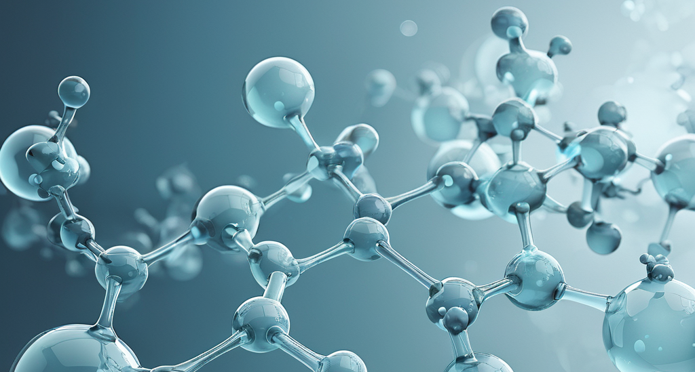

My PhD study is in the field of Systems Chemistry. I work on creating systems from organic molecules and simple chemical reactions with emergent life-like properties. These studies may help to answer a fundamental question of how life originated on Earth.

Before starting my PhD in WIS I had been working in fields of organic synthesis and materials chemistry.

The list of publications is available in my [ORCID profile](https://orcid.org/0000-0001-5945-4523).

